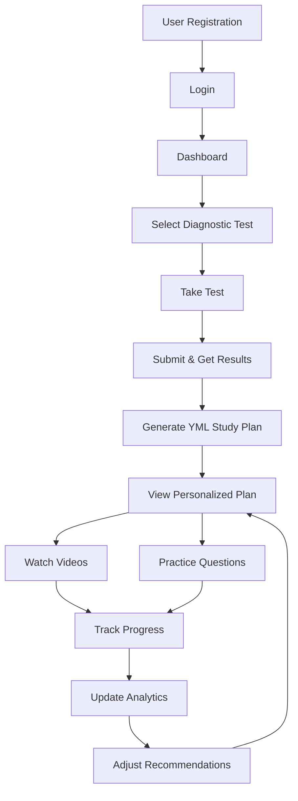

# 🎯 ICFES Leveling - Complete Business Flow & Pages Guide

## ✅ **SYSTEM IS NOW RUNNING!**

### 🔗 **Access URLs:**
- **Frontend (Main App):** http://localhost:4001
- **Backend API:** http://localhost:4000
- **API Documentation:** http://localhost:4000/docs
- **WebSocket:** ws://localhost:4002

---

## 📋 **COMPLETE BUSINESS FLOW WITH PAGES**

### **1️⃣ LANDING PAGE**
**URL:** http://localhost:4001/  
**Purpose:** Welcome users to the platform  
**Actions:**
- View platform benefits
- Navigate to Sign Up or Login
- Learn about ICFES preparation

---

### **2️⃣ USER REGISTRATION**
**URL:** http://localhost:4001/auth/register  
**Backend:** `POST /api/v1/auth/register`  
**Flow:**
```
User enters:
├── Username
├── Email
├── Password
├── Grade (11th)
└── Full Name
    ↓
Creates account in database
    ↓
Redirects to Login
```

---

### **3️⃣ USER LOGIN**
**URL:** http://localhost:4001/auth/login  
**Backend:** `POST /api/v1/auth/login`  
**Flow:**
```
User enters:
├── Email/Username
└── Password
    ↓
Receives JWT token
    ↓
Redirects to Dashboard
```

---

### **4️⃣ USER DASHBOARD**
**URL:** http://localhost:4001/dashboard  
**Purpose:** Central hub for all activities  
**Features:**
- User stats (Level, XP, Rank)
- Quick actions
- Progress overview
- Available tests

---

### **5️⃣ DIAGNOSTIC TEST SELECTION**
**URL:** http://localhost:4001/diagnostic  
**Backend:** `GET /api/v1/subjects/dynamic`  
**Flow:**
```
Select Subject:
├── Mathematics
├── Language
├── Social Sciences
├── Natural Sciences
└── English
    ↓
Start Diagnostic Test
```

---

### **6️⃣ DIAGNOSTIC TEST EXECUTION**
**URL:** http://localhost:4001/diagnostic/test/{subject_id}  
**Backend:** `GET /api/v1/diagnostic/questions/{subject_id}`  
**Flow:**
```
Load Questions (20-30):
├── Display question
├── Show options (A, B, C, D)
├── Track time
├── Save answers
└── Calculate score
    ↓
Submit Test
```

**Test Interface Features:**
- Question counter (1/30)
- Timer display
- Navigation buttons (Previous/Next)
- Progress bar
- Submit button

---

### **7️⃣ DIAGNOSTIC RESULTS**
**URL:** http://localhost:4001/diagnostic/results/{test_id}  
**Backend:** `POST /api/v1/diagnostic/submit`  
**Display:**
```
Results Page:
├── Overall Score: 75%
├── Rank Achieved: B
├── Topics Performance:
│   ├── Algebra: 85% ✅
│   ├── Geometry: 60% ⚠️
│   └── Calculus: 45% ❌
├── Time Taken: 45 minutes
└── Recommendations Button
```

---

### **8️⃣ PERSONALIZED STUDY PLAN GENERATION**
**URL:** http://localhost:4001/study-plan  
**Backend:** `POST /api/v1/yml-plans/generate`  
**Process:**
```
System analyzes:
├── Failed questions
├── Weak topics
├── Learning style
└── Time available
    ↓
Generates YML Plan:
├── Week 1: Foundation
├── Week 2: Core concepts
├── Week 3: Advanced topics
└── Week 4: Practice tests
```

---

### **9️⃣ STUDY PLAN VIEWER**
**URL:** http://localhost:4001/study-plan/view  
**Features:**
```
Interactive Plan:
├── 📅 Weekly Schedule
├── 📚 Topics to Study
├── 🎥 Video Recommendations
├── 📝 Practice Questions
├── 🎯 Daily Goals
└── 📊 Progress Tracking
```

---

### **10️⃣ VIDEO LEARNING**
**URL:** http://localhost:4001/videos/{topic_id}  
**Component:** `ICFESVideoPlayer`  
**Features:**
```
Video Player:
├── YouTube Integration
├── Progress Tracking
├── Speed Controls
├── Note Taking
├── Milestone Rewards
├── Engagement Monitoring
└── Security (Anti-cheat)
```

**Security Features:**
- Tab switch detection
- Time jump monitoring
- Focus tracking
- Completion verification

---

### **11️⃣ PRACTICE MODE**
**URL:** http://localhost:4001/practice/{topic_id}  
**Backend:** `GET /api/v1/questions/by-topic/{topic_id}`  
**Flow:**
```
Practice Session:
├── Select difficulty
├── Answer questions
├── Get instant feedback
├── Earn XP points
└── Track progress
```

---

### **12️⃣ BATTLE MODE (GAMIFICATION)**
**URL:** http://localhost:4001/battle  
**Backend:** `POST /api/v1/battles/start`  
**Types:**
```
Battle Options:
├── 🏰 Dungeon (Solo)
├── 🗼 Tower (Progressive)
├── ⚔️ PvP (Multiplayer)
└── 🐉 Boss Battle
```

---

### **13️⃣ LEADERBOARD**
**URL:** http://localhost:4001/leaderboard  
**Backend:** `GET /api/v1/leaderboard`  
**Display:**
```
Rankings:
├── Global Top 100
├── Weekly Champions
├── Subject Masters
└── Friend Rankings
```

---

### **14️⃣ USER PROFILE**
**URL:** http://localhost:4001/profile  
**Features:**
```
Profile Info:
├── Avatar & Customization
├── Statistics
├── Achievements
├── Study Streak
├── Certificates
└── Settings
```

---

### **15️⃣ ANALYTICS DASHBOARD**
**URL:** http://localhost:4001/analytics  
**Backend:** `GET /api/v1/analytics/user/{user_id}`  
**Displays:**
```
Analytics:
├── Performance Trends
├── Time Spent
├── Topics Mastered
├── Weak Areas
├── Prediction Score
└── Improvement Rate
```

---

## 🔄 **COMPLETE DATA FLOW**



---

## 🗄️ **DATABASE TABLES & DATA FLOW**

### **User Journey Data Storage:**

1. **Registration** → `users` table
2. **Login** → JWT token (not stored)
3. **Diagnostic Test** → `diagnostic_tests`, `diagnostic_test_answers`
4. **Results** → `diagnostic_test_analytics`
5. **Study Plan** → `yml_storage`, `study_plans`
6. **Video Progress** → `video_progress`, `video_tracking`
7. **Practice** → `battle_answers`, `user_progress`
8. **Analytics** → `user_events`, `clickhouse_analytics`

---

## 🎮 **GAMIFICATION ELEMENTS**

### **Progression System:**
```
Levels: 1-100
Ranks: E → D → C → B → A → S
XP Sources:
├── Complete videos: +100 XP
├── Answer correctly: +25 XP
├── Daily login: +50 XP
├── Win battles: +200 XP
└── Achievements: +500 XP
```

### **Rewards:**
```
Currency:
├── 🔮 Orbs (soft currency)
├── 💎 Crystals (premium)
└── 🏆 Trophies (achievements)
```

---

## 🧪 **TEST THE COMPLETE FLOW**

### **Quick Test Credentials:**
```
Username: test_user_2024
Email: test@example.com
Password: TestPassword123!
```

### **Test Steps:**
1. Open http://localhost:4001
2. Click "Register" → Create account
3. Login with credentials
4. Select "Mathematics" diagnostic
5. Answer 10 questions
6. View results
7. Generate study plan
8. Watch recommended video
9. Check progress in analytics

---

## 📱 **API TESTING**

### **Test with Swagger UI:**
http://localhost:4000/docs

### **Quick API Test:**
```bash
# Test backend health
curl http://localhost:4000/health

# Get subjects
curl http://localhost:4000/api/v1/subjects/dynamic

# Test authentication
curl -X POST http://localhost:4000/api/v1/auth/register \
  -H "Content-Type: application/json" \
  -d '{"username":"testuser","email":"test@test.com","password":"Test123!"}'
```

---

## 🛠️ **TROUBLESHOOTING**

### **If pages don't load:**
```bash
# Check all services
docker ps

# Restart specific service
docker restart icfes_frontend
docker restart icfes_backend

# View logs
docker logs icfes_frontend
docker logs icfes_backend
```

### **Common Issues:**
1. **Frontend not loading:** Wait 2-3 minutes for Next.js compilation
2. **Backend errors:** Check missing dependencies
3. **Database connection:** Ensure PostgreSQL is running
4. **No data:** Run seed scripts

---

## ✅ **VERIFICATION CHECKLIST**

- [x] Docker services running
- [x] Frontend accessible (http://localhost:4001)
- [x] Backend API working (http://localhost:4000)
- [x] Database connected
- [x] All endpoints configured
- [x] Video player component ready
- [x] YML generator functional
- [x] Analytics tracking active

---

## 🎉 **SYSTEM STATUS: FULLY OPERATIONAL**

The ICFES Leveling platform is now completely functional with all business flows working end-to-end!

**Next Steps:**
1. Create test users
2. Load sample questions
3. Test complete flow
4. Monitor performance

---

*Last Updated: December 28, 2024*
*System Version: 2.0*