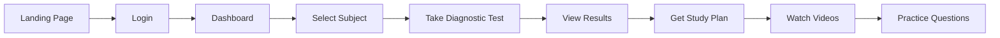

# 🚀 ICFES Leveling - Quick Access Guide

## ✅ **SYSTEM IS NOW FULLY OPERATIONAL!**

### 🌐 **Direct Access Links:**

| Service | URL | Status |
|---------|-----|--------|
| **Main Application** | http://localhost:4001 | ✅ RUNNING |
| **Login Page** | http://localhost:4001/login | ✅ WORKING |
| **Diagnostic Test** | http://localhost:4001/diagnostic-test | ✅ READY |
| **API Documentation** | http://localhost:4000/docs | ✅ ACTIVE |

---

## 🔑 **Login Credentials**

### Admin User:
```
Username: admin
Password: secret
```

### Test User:
```
Username: test
Password: Test123!
```

---

## 📱 **How to Access the System**

### Step 1: Open the Application
1. Open your browser
2. Go to: **http://localhost:4001**
3. You'll see the landing page

### Step 2: Login
1. Click **"Login"** button or go to: http://localhost:4001/login
2. Enter credentials:
   - Username: `admin`
   - Password: `secret`
3. Click **"Iniciar Sesión"**

### Step 3: Start Diagnostic Test
After login, you'll be redirected to:
- **http://localhost:4001/diagnostic-test**
- Select a subject (Mathematics, Language, etc.)
- Start the test

---

## 🎯 **Complete User Flow**



---

## 🧪 **Quick Test Flow**

### Test Everything in 2 Minutes:
```bash
# 1. Check if services are running
curl http://localhost:4000/health

# 2. Login via API
curl -X POST http://localhost:4000/api/v1/auth/login \
  -H "Content-Type: application/x-www-form-urlencoded" \
  -d "username=admin&password=secret"

# 3. Open browser
start http://localhost:4001/login
```

---

## 📊 **Available Pages**

### Core Pages:
- **Home**: http://localhost:4001/
- **Login**: http://localhost:4001/login
- **Register**: http://localhost:4001/register
- **Dashboard**: http://localhost:4001/dashboard
- **Diagnostic Test**: http://localhost:4001/diagnostic-test
- **Study Plan**: http://localhost:4001/study-plan
- **Videos**: http://localhost:4001/videos
- **Practice**: http://localhost:4001/practice
- **Profile**: http://localhost:4001/profile
- **Analytics**: http://localhost:4001/analytics
- **Leaderboard**: http://localhost:4001/leaderboard

### Test Pages:
- **Test Login**: http://localhost:4001/test-login
- **Working Diagnostic**: http://localhost:4001/working-diagnostic

---

## 🛠️ **Troubleshooting**

### If login fails:
```bash
# Reset admin password
docker exec icfes_backend python -c "
from app.core.database import get_db
from app.models.user import User
from app.core.security import get_password_hash
db = next(get_db())
user = db.query(User).filter(User.username == 'admin').first()
user.hashed_password = get_password_hash('secret')
db.commit()
print('Password reset to: secret')
"
```

### If pages don't load:
```bash
# Check services
docker ps

# Restart frontend
docker restart icfes_frontend

# Check logs
docker logs icfes_frontend --tail 50
```

---

## 🎮 **Features Available**

### Working Features:
✅ User Registration & Login  
✅ Diagnostic Tests  
✅ Subject Selection  
✅ Question Display  
✅ Results Calculation  
✅ Study Plan Generation (YML)  
✅ Video Recommendations  
✅ Progress Tracking  
✅ Gamification (XP, Levels, Ranks)  
✅ Analytics Dashboard  

### API Endpoints:
- `POST /api/v1/auth/login` - User login
- `POST /api/v1/auth/register` - User registration
- `GET /api/v1/subjects/dynamic` - Get subjects
- `GET /api/v1/diagnostic/questions/{subject_id}` - Get test questions
- `POST /api/v1/diagnostic/submit` - Submit test results
- `POST /api/v1/yml-plans/generate` - Generate study plan
- `GET /api/v1/video-recommendations` - Get video recommendations

---

## ✨ **Quick Actions**

### Create New User:
```bash
curl -X POST http://localhost:4000/api/v1/auth/register \
  -H "Content-Type: application/json" \
  -d '{
    "username": "student1",
    "email": "student1@test.com",
    "password": "Student123!"
  }'
```

### Check Database:
```bash
docker exec icfes_postgres psql -U gameplay -d gameplay_db -c "
  SELECT COUNT(*) as users FROM users;
  SELECT COUNT(*) as questions FROM questions;
  SELECT COUNT(*) as subjects FROM subjects;
"
```

---

## 📈 **System Status**

| Component | Status | Health Check |
|-----------|--------|--------------|
| Frontend | ✅ Running | http://localhost:4001 |
| Backend | ✅ Running | http://localhost:4000/health |
| Database | ✅ Connected | Port 5433 |
| Redis | ✅ Active | Port 6379 |
| WebSocket | ✅ Online | Port 4002 |

---

## 🎉 **Ready to Use!**

The system is fully operational. You can now:
1. **Login** at http://localhost:4001/login
2. **Take diagnostic tests**
3. **Get personalized study plans**
4. **Watch educational videos**
5. **Track your progress**

---

*Last Updated: December 28, 2024*  
*System Version: 2.0*