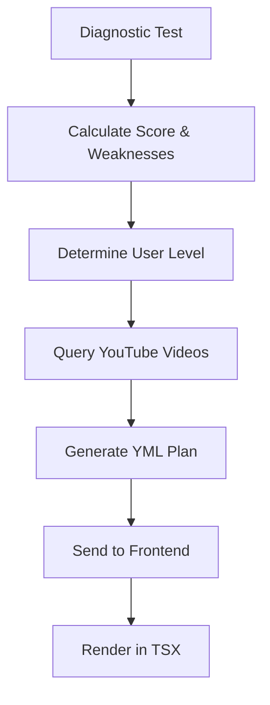

# 🧠 ICFES LEVELING - COMPLETE RECOMMENDATION SYSTEM ARCHITECTURE

## 📊 HOW THE RECOMMENDATION SYSTEM WORKS

### 1. **DIAGNOSTIC TEST ANALYSIS & WEAKNESS CALCULATION**

#### A. **Data Collection During Test**
```javascript
// From test-interface.tsx
const testAnswers = questions.map(q => ({
  question_id: q.id,
  user_answer: answers[q.id] || '',
  response_time_ms: responseTimes[q.id] || 0  // ← Time tracking
}));
```

#### B. **Weakness Calculation Algorithm**
```python
# Backend calculates weaknesses based on:
def calculate_weaknesses(test_answers):
    weaknesses = {
        'topics': [],           # Topics with < 40% accuracy
        'cognitive_process': [], # Processes with low scores
        'time_issues': [],      # Questions taking > 3x average time
        'pattern_errors': []    # Repeated mistake patterns
    }
    
    # Group by topic
    for topic in topics:
        accuracy = correct_in_topic / total_in_topic
        if accuracy < 0.4:  # Less than 40%
            weaknesses['topics'].append({
                'topic': topic.name,
                'accuracy': accuracy,
                'priority': 'HIGH' if accuracy < 0.2 else 'MEDIUM'
            })
    
    return weaknesses
```

### 2. **YOUTUBE VIDEO MATCHING SYSTEM**

#### A. **Database Structure**
```sql
-- youtube_links table stores:
├── codigo_tema (ICFES topic code)
├── area_evaluada (Math, Science, etc.)
├── tema_principal (Main topic)
├── youtube_url (Direct video link)
├── query_sugerida (Search query)
├── nivel_dificultad (1-5)
├── proceso_cognitivo (Cognitive process)
└── calidad_score (Quality rating)
```

#### B. **Video Selection Algorithm**
```python
def select_videos_for_weakness(weakness_topic, user_level):
    """
    Matches YouTube videos based on:
    1. Topic alignment
    2. Difficulty level
    3. Quality score
    4. View count & likes ratio
    """
    
    videos = db.query(YouTubeLinks).filter(
        YouTubeLinks.tema_principal.contains(weakness_topic),
        YouTubeLinks.nivel_dificultad <= user_level + 1,  # Slightly challenging
        YouTubeLinks.calidad_score >= 0.7,
        YouTubeLinks.estado == 'activo'
    ).order_by(
        desc(YouTubeLinks.relevancia_score),
        desc(YouTubeLinks.calidad_score)
    ).limit(3).all()
    
    return [v.youtube_url for v in videos]
```

### 3. **STUDY PLAN GENERATION FLOW**



#### A. **Backend Processing** (`study_plans_simple.py`)
```python
@router.get("/generate/{subject_id}")
async def generate_study_plan(subject_id: str):
    # 1. Get diagnostic results
    score = get_diagnostic_score(subject_id)
    
    # 2. Determine difficulty level
    level = "beginner" if score < 50 else "intermediate" if score < 80 else "advanced"
    
    # 3. Select appropriate template
    template = KHAN_ACADEMY_TEMPLATES[subject][level]
    
    # 4. For each weakness, add videos
    for unit in template['units']:
        for topic in unit['topics']:
            # Match YouTube videos
            topic['videos'] = get_youtube_videos(topic['name'], level)
            
    # 5. Add personalized recommendations
    recommendations = {
        'focus': get_focus_area(score),
        'daily_time': get_recommended_time(score),
        'strategy': get_learning_strategy(score),
        'priority_topics': get_priority_topics(weaknesses)
    }
    
    return {
        'units': template['units'],
        'recommendations': recommendations,
        'weekly_schedule': generate_schedule(units)
    }
```

### 4. **YML GENERATION & TSX CONNECTION**

#### A. **YML Structure Generated**
```yaml
# Generated dynamically based on weaknesses
study_plan:
  metadata:
    user_id: "user-123"
    subject: "Matemáticas"
    level: "intermediate"
    diagnostic_score: 65
    
  units:
    - number: 1
      title: "Álgebra Avanzada"
      topics:
        - name: "Funciones cuadráticas"
          videos:
            - url: "https://youtube.com/watch?v=Y036bRD36gY"
              title: "Intro to Quadratic Functions"
              duration: 900  # seconds
          exercises: 25
          weakness_priority: HIGH  # ← Based on diagnostic
          
  recommendations:
    focus: "Consolidación de conceptos intermedios"
    daily_time: "60-90 minutos"
    priority_topics:
      - "Funciones cuadráticas"  # ← From weakness analysis
      - "Sistemas de ecuaciones"
      
  schedule:
    monday:
      topic: "Funciones cuadráticas"  # ← Prioritized weakness
      time: 60
```

#### B. **TSX Frontend Rendering** (`study-plan-view/page.tsx`)
```typescript
// 1. Fetch the generated plan
const loadStudyPlan = async () => {
  const response = await fetch(`/api/v1/study-plans/generate/${subjectId}`);
  const data = await response.json();  // ← YML converted to JSON
  setStudyPlan(data);
};

// 2. Render with React components
{studyPlan.units.map(unit => (
  <div key={unit.number}>
    <h3>{unit.title}</h3>
    {unit.topics.map(topic => (
      <div>
        <p>{topic.name}</p>
        {/* Weakness indicator */}
        {topic.weakness_priority === 'HIGH' && (
          <span className="text-red-400">⚠️ Needs Focus</span>
        )}
        {/* YouTube videos */}
        {topic.videos.map(video => (
          <iframe src={`https://youtube.com/embed/${getVideoId(video)}`} />
        ))}
      </div>
    ))}
  </div>
))}
```

### 5. **CSS STYLING SYSTEM (GLASSMORPHISM)**

#### A. **Tailwind + Custom CSS**
```css
/* Glassmorphism effect */
.khan-card {
  background: rgba(0, 0, 0, 0.3);
  backdrop-filter: blur(10px);
  border: 1px solid rgba(139, 92, 246, 0.3);
}

/* Gradient animation */
.gradient-bg {
  background: linear-gradient(-45deg, #667eea, #764ba2, #f093fb, #f5576c);
  background-size: 400% 400%;
  animation: gradient 15s ease infinite;
}

@keyframes gradient {
  0% { background-position: 0% 50%; }
  50% { background-position: 100% 50%; }
  100% { background-position: 0% 50%; }
}

/* Progress bar */
.progress-bar {
  background: linear-gradient(90deg, 
    #10b981 0%, 
    #3b82f6 ${progress}%, 
    #6b7280 ${progress}%
  );
}
```

#### B. **Component Styling in TSX**
```typescript
// Conditional styling based on performance
const getDifficultyColor = (difficulty: string) => {
  switch(difficulty) {
    case 'básico': return 'bg-green-500/20 text-green-400';
    case 'intermedio': return 'bg-yellow-500/20 text-yellow-400';
    case 'avanzado': return 'bg-red-500/20 text-red-400';
  }
};

// Dynamic classes based on weakness
<div className={`
  ${topic.isWeakness ? 'border-red-500' : 'border-purple-500'}
  ${topic.completed ? 'opacity-50' : 'opacity-100'}
  rounded-lg p-4 transition-all
`}>
```

### 6. **COMPLETE DATA FLOW**

```javascript
// 1. DIAGNOSTIC TEST SUBMISSION
handleSubmit() {
  results = calculateResults(answers);
  sessionStorage.setItem('diagnostic_results', results);
  router.push('/diagnostic-test/results');
}

// 2. RESULTS PAGE - TRIGGER PLAN GENERATION
createStudyPlan() {
  sessionStorage.setItem('diagnostic_score', results.percentage);
  router.push('/study-plan-view');
}

// 3. STUDY PLAN VIEW - FETCH PERSONALIZED PLAN
useEffect(() => {
  // Backend generates plan based on:
  // - Diagnostic score
  // - Identified weaknesses
  // - YouTube video matching
  // - User level
  
  fetch(`/api/v1/study-plans/generate/${subjectId}`)
    .then(plan => {
      // Plan includes:
      // - Units ordered by priority
      // - YouTube videos for weak topics
      // - Personalized schedule
      // - Gamification elements
      setStudyPlan(plan);
    });
}, []);

// 4. RENDER KHAN ACADEMY STYLE UI
return (
  <div className="gradient-bg">
    {/* Progress tracking */}
    <ProgressBar value={plan.progress} />
    
    {/* Units with videos */}
    {plan.units.map(unit => (
      <Unit 
        topics={unit.topics}
        videos={unit.videos}  // ← YouTube videos
        isWeakness={unit.priority === 'HIGH'}
      />
    ))}
    
    {/* Recommendations */}
    <Recommendations 
      focus={plan.recommendations.focus}
      dailyTime={plan.recommendations.daily_time}
    />
  </div>
);
```

### 7. **KEY ALGORITHMS**

#### A. **Weakness Priority Calculation**
```python
def calculate_priority(topic_accuracy, time_spent, importance_weight):
    """
    Priority = (1 - accuracy) * importance * time_factor
    """
    time_factor = 1.5 if time_spent > avg_time * 2 else 1.0
    priority_score = (1 - topic_accuracy) * importance_weight * time_factor
    
    if priority_score > 0.7:
        return 'HIGH'
    elif priority_score > 0.4:
        return 'MEDIUM'
    else:
        return 'LOW'
```

#### B. **Video Relevance Scoring**
```python
def calculate_video_relevance(video, weakness_topic, user_level):
    """
    Relevance = topic_match * level_match * quality * engagement
    """
    topic_match = fuzz.ratio(video.tema_principal, weakness_topic) / 100
    level_match = 1 - abs(video.nivel_dificultad - user_level) * 0.2
    quality = video.calidad_score
    engagement = video.like_count / (video.view_count + 1)
    
    return topic_match * 0.4 + level_match * 0.2 + quality * 0.3 + engagement * 0.1
```

### 8. **RESPONSIVE DESIGN SYSTEM**

```css
/* Mobile-first responsive design */
@media (max-width: 640px) {
  .unit-grid { grid-template-columns: 1fr; }
  .video-container { aspect-ratio: 16/9; }
}

@media (min-width: 768px) {
  .unit-grid { grid-template-columns: repeat(2, 1fr); }
}

@media (min-width: 1024px) {
  .unit-grid { grid-template-columns: repeat(3, 1fr); }
}
```

## 🎯 SUMMARY

The recommendation system works through:

1. **Diagnostic Analysis**: Calculates weaknesses from test answers
2. **YouTube Matching**: Finds relevant videos for weak topics
3. **Plan Generation**: Creates YML/JSON structure with personalized content
4. **Frontend Rendering**: TSX components display the plan beautifully
5. **CSS Styling**: Glassmorphism and animations for Khan Academy feel

The system is **fully adaptive** and **personalized** based on individual performance!