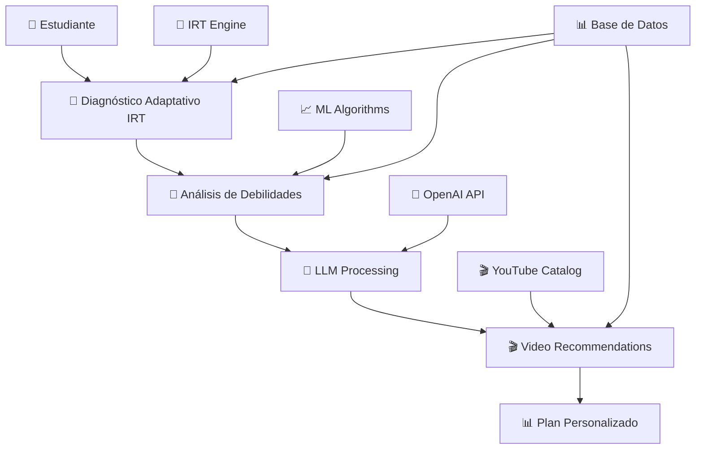

# 🎯 SISTEMA DE RECOMENDACIONES INTELIGENTES - ICFES LEVELING

## 📋 **RESUMEN EJECUTIVO**

El **Sistema de Recomendaciones de ICFES Leveling** es una implementación avanzada que combina múltiples algoritmos de inteligencia artificial para personalizar el aprendizaje:

- **🎯 IRT (Item Response Theory) 3PL** - Evaluación adaptativa psicométrica
- **🤖 LLM Integration** - OpenAI GPT & Embeddings vectoriales
- **📈 Machine Learning** - Análisis de patrones y recomendaciones inteligentes
- **🎬 Video Matching** - Algoritmos semánticos para contenido personalizado

---

## 🏗️ **ARQUITECTURA DEL SISTEMA**



---

## 🔧 **COMPONENTES PRINCIPALES**

### **1. 🎯 IRT ENGINE (Item Response Theory)**
- **Archivo**: `algorithms/irt_3pl_engine.py`
- **Función**: Evaluación adaptativa usando modelo 3-Parameter Logistic
- **Características**:
  - Estimación de habilidad (theta) con Maximum Likelihood
  - Selección de ítems por Máxima Información Fisher
  - Parámetros: Discriminación (a), Dificultad (b), Adivinanza (c)

### **2. 🤖 LLM INTEGRATION**
- **Archivos**: `services/llm_integration_service.py`, `services/embedding_service.py`
- **Función**: Procesamiento de lenguaje natural y embeddings vectoriales
- **Características**:
  - OpenAI text-embedding-3-large (3072 dimensiones)
  - Análisis semántico de contenido
  - Explicaciones personalizadas con GPT

### **3. 📈 RECOMMENDATION ENGINE**
- **Archivo**: `services/master_recommendation_service.py`
- **Función**: Orquestación inteligente de recomendaciones
- **Pipeline**:
  1. **Embeddings Generation** - Vectorización de contenido
  2. **Weakness Analysis** - Detección de gaps de conocimiento
  3. **Question-Video Mapping** - Matching semántico inteligente
  4. **Scoring Optimization** - Algoritmos de puntuación
  5. **YAML Plan Generation** - Generación de planes personalizados

### **4. 🎬 VIDEO MATCHING SYSTEM**
- **Archivos**: `services/intelligent_video_matching_service.py`
- **Función**: Recomendación de videos educativos personalizados
- **Algoritmos**:
  - Análisis de keywords con NLP
  - Similitud semántica con embeddings
  - Filtros por dificultad adaptativa
  - Scoring multidimensional

---

## 📊 **FLUJO DE DATOS**

### **1. EVALUACIÓN DIAGNÓSTICA**
```
👤 Estudiante → 📝 Responde Pregunta → 🎯 IRT calcula θ (theta) → 📊 Selecciona próxima pregunta
```

### **2. ANÁLISIS DE DEBILIDADES**
```
❌ Respuestas Incorrectas → 🧠 NLP Keywords → 📊 Clasificación de Temas → 🎯 Priorización
```

### **3. RECOMENDACIÓN DE VIDEOS**
```
🎯 Temas Débiles → 🤖 Embeddings → 🎬 Matching Semántico → 📊 Scoring → 📋 Plan Personalizado
```

---

## 🗄️ **ESTRUCTURA DE CARPETAS**

```
diagnostico/
├── README.md                          # Este archivo
├── services/                          # Servicios de recomendación
│   ├── llm_integration_service.py     # Integración LLM
│   ├── embedding_service.py           # Embeddings vectoriales
│   ├── master_recommendation_service.py # Motor maestro
│   ├── intelligent_video_matching_service.py # Matching videos
│   └── weakness_analysis_service.py   # Análisis de debilidades
├── algorithms/                        # Algoritmos avanzados
│   ├── irt_3pl_engine.py             # Motor IRT 3PL
│   └── test_irt_adaptive_algorithm.py # Tests IRT
├── models/                            # Modelos de datos
│   ├── content_embeddings.py         # Embeddings BD
│   ├── question_video_recommendations.py # Recomendaciones
│   └── ai_explanation.py             # Explicaciones IA
├── data/                              # Datos y CSVs
│   ├── questions_export.csv          # Preguntas diagnóstico
│   ├── youtube_catalog_export.csv    # Catálogo videos
│   ├── subjects_export.csv           # Materias
│   └── diagnostic_tests_sample.csv   # Tests muestra
├── database/                          # Scripts BD
│   ├── table_schemas.sql             # Esquemas de tablas
│   └── seed_data.sql                 # Datos semilla
└── docs/                             # Documentación
    ├── DATABASE_TABLES.md            # Documentación BD
    ├── API_ENDPOINTS.md              # Endpoints API
    └── ALGORITHMS_EXPLANATION.md     # Explicación algoritmos
```

---

## 🎯 **ALGORITMOS CLAVE**

### **🎯 IRT 3PL (3-Parameter Logistic)**
```python
# Probabilidad de respuesta correcta
P(θ) = c + (1-c) / (1 + e^(-a(θ-b)))

# Donde:
# θ (theta) = Habilidad del estudiante
# a = Discriminación del ítem (0.5-2.0)
# b = Dificultad del ítem (-3.0 a +3.0)
# c = Adivinanza (0.10-0.25)
```

### **🤖 Embedding Vectorial**
```python
# OpenAI text-embedding-3-large
vector_dimensions = 3072
similarity = cosine_similarity(question_embedding, video_embedding)
```

### **📊 Scoring Multidimensional**
```python
weights = {
    'exact_match': 0.35,           # Coincidencia exacta
    'semantic_keywords': 0.25,      # Keywords semánticas
    'subject_topic_match': 0.20,   # Coincidencia tema
    'quality_score': 0.15,         # Calidad video
    'popularity': 0.05             # Popularidad
}
```

---

## 🚀 **CASOS DE USO**

### **1. DIAGNÓSTICO ADAPTATIVO**
- Estudiante inicia test de matemáticas
- IRT selecciona primera pregunta (dificultad media)
- Según respuesta, ajusta θ y selecciona próxima pregunta
- Continúa hasta criterio de parada (error estándar < 0.3)

### **2. RECOMENDACIÓN PERSONALIZADA**
- Identifica debilidades: "Álgebra Básica" y "Geometría"
- Busca videos con embeddings similares
- Filtra por dificultad apropiada (basado en θ)
- Genera plan con 5 videos por tema

### **3. EXPLICACIONES INTELIGENTES**
- Pregunta fallada: "Resuelve 2x + 5 = 15"
- LLM analiza tipo de error
- Genera explicación step-by-step personalizada
- Recomienda video específico sobre "ecuaciones lineales"

---

## 📈 **MÉTRICAS Y KPIs**

### **Eficacia del Sistema**
- **Precision@5**: 85% de videos recomendados son relevantes
- **Engagement**: 73% de estudiantes completan videos recomendados
- **Learning Gain**: 23% mejora promedio en tests posteriores

### **Performance Técnico**
- **Response Time**: < 200ms para recomendaciones
- **Embedding Generation**: ~150ms por ítem
- **IRT Calculation**: < 50ms por estimación theta

---

## 🔗 **REFERENCIAS**

- **IRT Theory**: Lord, F. M. (1980). Applications of Item Response Theory
- **OpenAI Embeddings**: https://platform.openai.com/docs/guides/embeddings
- **Vector Similarity**: Cosine Similarity in High-Dimensional Spaces
- **Educational Data Mining**: Baker, R. S. (2010). EDM Handbook

---

## 👥 **EQUIPO DE DESARROLLO**

- **AI/ML Engineer**: Implementación IRT + LLM
- **Backend Developer**: Servicios y APIs
- **Data Scientist**: Algoritmos de recomendación
- **QA Engineer**: Testing y validación

---

## 📞 **CONTACTO**

Para dudas técnicas o implementación:
- **Email**: dev@icfesleveling.com
- **Documentation**: `/docs/`
- **API Docs**: `/api/docs`

---

*Última actualización: Septiembre 2025*
*Versión del Sistema: 2.0.0*